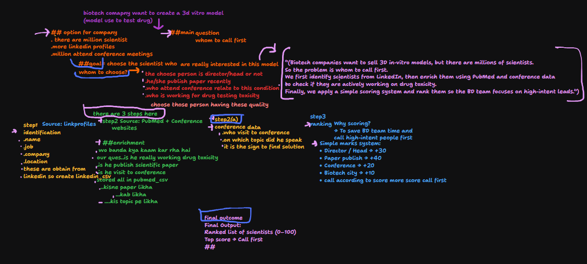
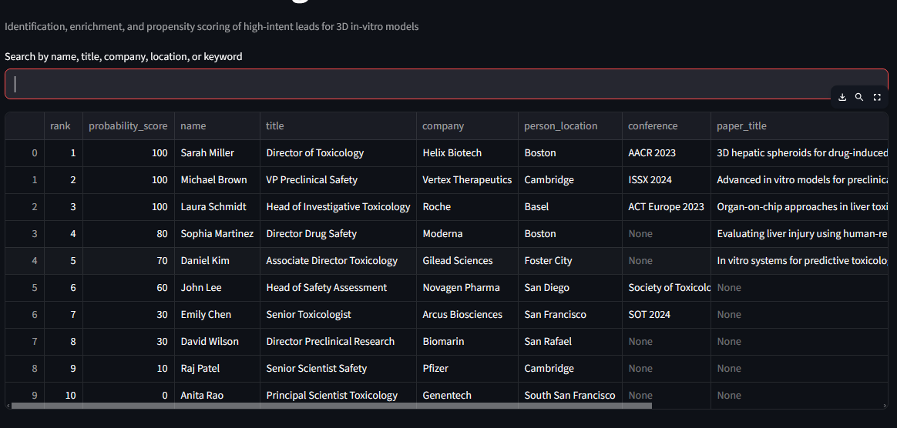

# Biotech Lead Intelligence System

## Problem Statement
Biotech business development teams often face challenges in efficiently identifying high-quality leads.  
The absence of a unified system that integrates scientific activity, role relevance, and company readiness
results in significant time spent pursuing low-intent prospects.

This project addresses the need for a streamlined approach to prioritize high-probability buyers of
advanced **3D in-vitro models**.

## screenshot

## streamlit link
 **Live Demo:** [Click here to view](https://biotech-intelligence.streamlit.app/)

## screenshot

## Project Overview
This proof-of-concept lead intelligence system demonstrates how to:

- Identify relevant scientists and decision-makers
- Enrich profiles with scientific and market signals
- Rank leads using a business-driven **propensity score (0–100)**

The focus of this project is on **decision logic and prioritization**, not scale.

## Data Sources
The demo leverages **simulated/public data** inspired by the following sources:

- Professional profiles (LinkedIn-style data)
- Scientific publications (PubMed-style data)
- Conference participation records (SOT, AACR, ISSX)

> **Note:** In a production environment, data enrichment would be automated using APIs such as
> LinkedIn Sales Navigator, PubMed, Crunchbase, and conference databases.

## API-Ready Architecture
This proof-of-concept uses simulated/public data to demonstrate the end-to-end
identification, enrichment, and ranking logic. The data ingestion layer is designed
to be modular and can be seamlessly replaced with real-time integrations such as
LinkedIn Sales Navigator, Proxycurl, PubMed, and funding intelligence APIs in a
production environment, without changing the scoring or ranking logic.

## Methodology

### 1. Identification
A base list of relevant profiles is compiled based on role, domain, and organization.

### 2. Enrichment
Each profile is enriched with:
- Scientific intent (recent drug/toxicity publications)
- Market activity (conference participation)
- Geographic relevance (biotech hubs)

### 3. Ranking
Weighted business rules are applied to assign a **probability score (0–100)** indicating the likelihood
that a lead would engage with 3D in-vitro model solutions.

## Output
The system produces a **searchable and exportable dashboard** that ranks leads by their
propensity to engage, enabling business development teams to focus outreach on
the highest-intent prospects.

## Disclaimer
This project is a **proof-of-concept** built using simulated/public data for demonstration purposes only.
No private, scraped, or proprietary data is used.
